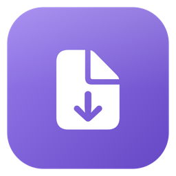

<p align="center">
  
</p>

<h1 align="center">Bookdrop</h1>

<p align="center">
  Drag in an EPUB, Kindle book, or PDF — get back a PDF, EPUB, TXT, HTML, or DOCX.<br>
  PDF conversion runs on bundled headless Chromium.
</p>

## What it does

Drop a book onto the window (or use the file picker) — EPUB, AZW3/AZW/KFX/MOBI, or PDF — and
Bookdrop converts it to your choice of PDF, EPUB, TXT, HTML, or DOCX. For PDF output
specifically, you get real control over the result: page size (US Letter, A4, A5, or custom),
margins, orientation, typography (font, size, line spacing), headers/footers/page numbers, cover
inclusion, and table-of-contents generation, all live-previewed against the actual book.

PDF *input* is a deliberately scoped MVP: it reads text-layer PDFs and reconstructs chapters
from font sizes and the PDF's own bookmarks where available, but it can't reflow scanned/
image-only PDFs, multi-column layouts, or encrypted PDFs — those are detected and refused with a
clear message rather than silently producing garbage.

Multi-file conversion, a running history of past conversions, and macOS notifications when a
batch finishes are all built in.

## Requirements

- macOS 13 (Ventura) or later
- Apple Silicon or Intel — the released `.dmg` is a universal (arm64 +
  x86_64) binary. **The x86_64 build is lightly tested:** it's confirmed to
  launch correctly under Rosetta 2 on Apple Silicon, but hasn't been run on
  real Intel hardware or used to actually convert a book on that
  architecture. If you hit trouble on an Intel Mac, please
  [open an issue](../../issues) — that's the first place a real-hardware
  bug would show up.

## Install

1. Download the latest `.dmg` from [Releases](../../releases/latest).
2. Open the disk image and drag **Bookdrop** into **Applications**.
3. **First launch:** Bookdrop isn't notarized by Apple (no paid developer account behind this),
   so Gatekeeper will block it the first time. Right-click (or Control-click) `Bookdrop.app` in
   Applications and choose **Open**, then confirm **Open** in the dialog that appears. You only
   need to do this once.

If step 3 doesn't work or you'd rather use the terminal:

```sh
xattr -dr com.apple.quarantine /Applications/Bookdrop.app
```

## Using it

Drop a book on the window, pick an output format, adjust options if you want (the PDF panel
covers page size, margins, typography, and headers/footers/page numbers), and convert. Drop
multiple files at once to batch-convert them all to the same format. Past conversions, with
quick links back to the source and output files, live in the history view.

## How it works

Every format runs on **`anyform`**, a small Rust engine (`Bookdrop/rust/`): EPUB and
Kindle-family books (normalized to EPUB by a bundled `boko` binary) are parsed directly; PDFs
are read via a bundled `pdfium` library and reconstructed into chapters from font sizes and the
PDF's own bookmarks. For PDF *output*, each chapter renders through a bundled, self-contained
headless Chromium build via the DevTools Protocol — the same class of approach calibre's PDF
output uses, rather than reimplementing HTML/CSS layout from scratch — and pages are merged with
`lopdf` into one document with a real outline built from the book's table of contents. EPUB/TXT/
HTML/DOCX output are pure Rust, no external engine. The Swift app talks to all of this through a
small C ABI (`anyform-ffi`).

See [`ANYFORM-FULL-SPEC.md`](ANYFORM-FULL-SPEC.md) for the full architecture writeup, the known
limits of PDF input, and the roadmap.

## Building from source

Needs Xcode's command-line tools and a Rust toolchain ([rustup](https://rustup.rs)):

```sh
git clone https://github.com/tilakp/bookdrop.git
cd bookdrop/Bookdrop
rust/scripts/fetch-chromium.sh   # downloads the bundled Chromium binary (~90MB)
rust/scripts/fetch-boko.sh       # downloads the bundled Kindle-format converter
rust/scripts/fetch-pdfium.sh     # downloads the bundled PDF reader
rust/scripts/build-ffi.sh        # builds the Rust engine into a linkable static lib
swift build
swift test
```

44 Swift tests plus 99 Rust tests. Most of the PDF-related ones render through the real bundled
Chromium binary (or read through the real bundled PDF reader) rather than mocking it, so expect
the suite to take about 30 seconds.

`swift run` launches the app as a bare executable: no Dock icon, no working system
notifications (both need a real bundle identifier `swift run` can't provide). For the real
thing, or to produce your own DMG:

```sh
./Scripts/build-app.sh debug && open .build/debug/Bookdrop.app   # quick local run
./Scripts/release.sh                                             # Release build + install + DMG
```

`release.sh` needs [`create-dmg`](https://github.com/create-dmg/create-dmg)
(`brew install create-dmg`) for the disk-image step.

## Project layout

- `Bookdrop/Sources/Bookdrop/`: the app. `Models/`, `Services/` (EPUB/Kindle parsing, the
  Rust-engine bridge, app coordinator), `Views/`, `App/`
- `Bookdrop/Sources/CAnyform/`: the C header bridge SwiftPM links against the Rust engine through
- `Bookdrop/rust/`: the `anyform` engine. `anyform-core` (traits/registry), `anyform-doc` (EPUB/
  Kindle-family/PDF input, PDF/EPUB/TXT/HTML/DOCX output), `anyform-ffi` (the C ABI Swift calls),
  `anyform-cli` (a standalone `anyform convert book.epub book.pdf` binary for testing the engine
  in isolation)
- `Bookdrop/Tests/BookdropTests/`: the Swift test suite. `Bookdrop/rust/*/tests/`: the Rust one
- `Bookdrop/Scripts/`: icon generation, `.app` bundle assembly (`build-app.sh`), release/DMG
  packaging (`release.sh`)
- `ANYFORM-FULL-SPEC.md`: the full spec. Engine architecture, macOS UX design, decisions made
  along the way, and the roadmap
- `archive/`: the original source documents the spec was merged from

## License

[MIT](LICENSE)
